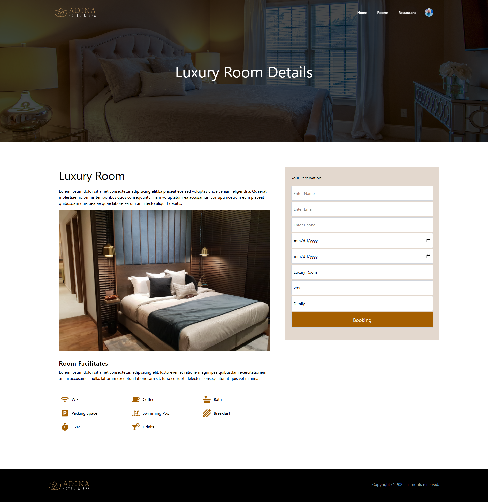
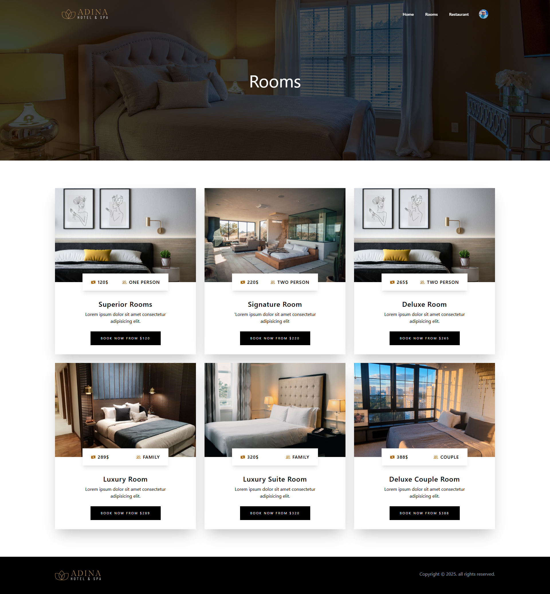
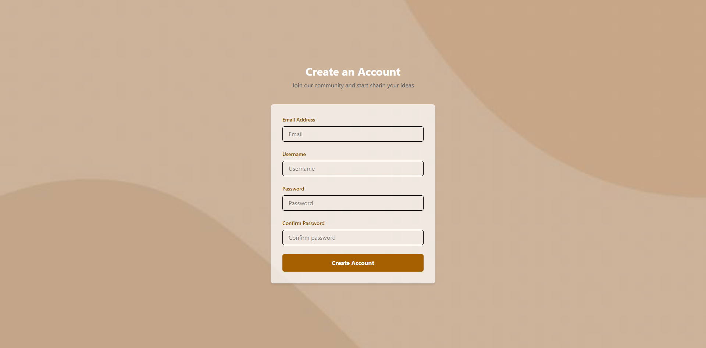
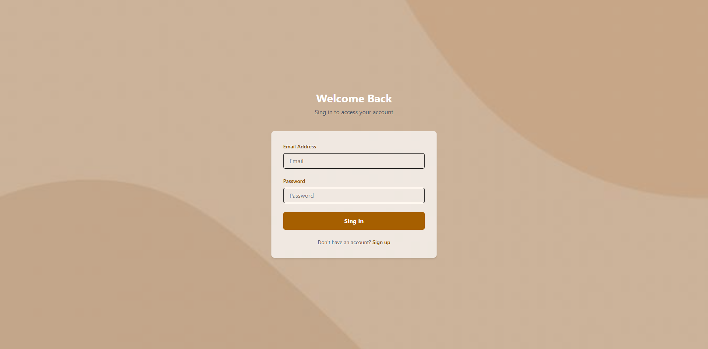
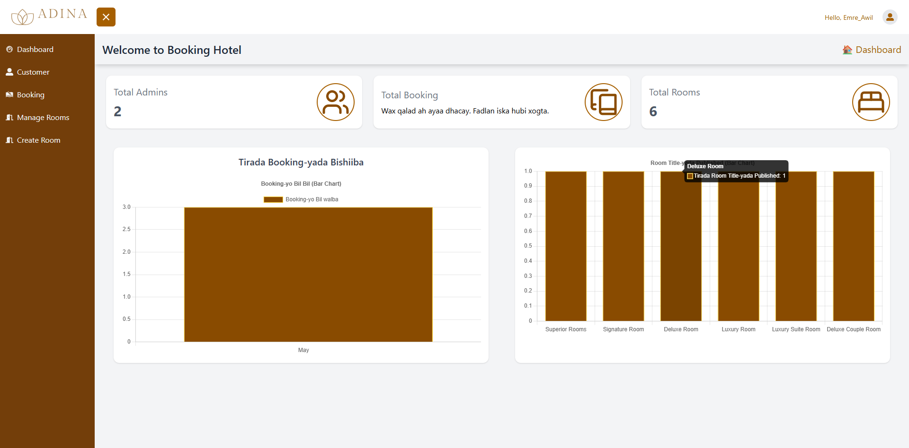
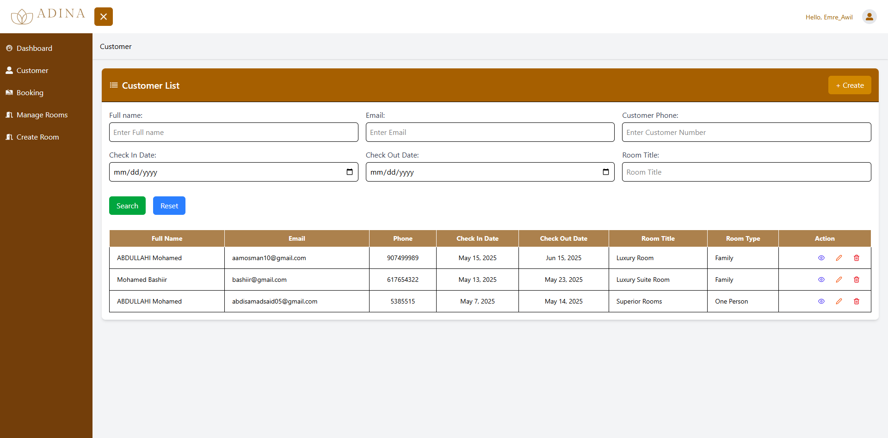
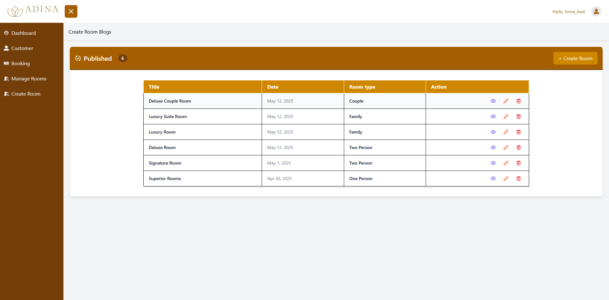
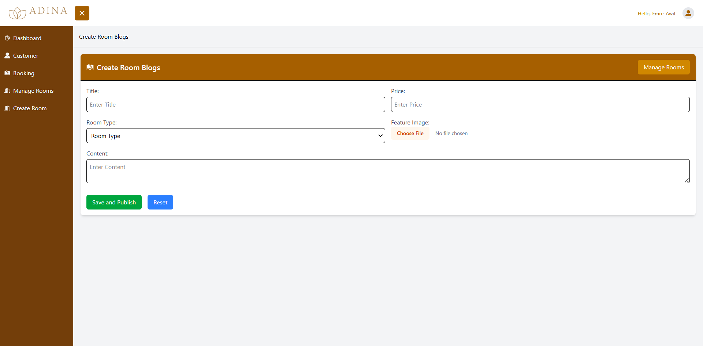

# 🏨 Hotel Booking Web Application

This is a web-based hotel booking system that allows users to browse available rooms, view restaurant options, and make reservations. The application includes a full-featured admin dashboard to manage bookings, rooms, and restaurant details.

---

## 📁 Project Structure

/hotel-booking/
├── client/ # Frontend code (React / TailwindCss)
├── server/ # Backend code (Vite)
├── database/ # Supabase
├── README.md

---

## 🚀 Features

### 👤 User Side
- 🏠 **Home Page** – View hotel intro, highlights, and quick links.
- 🛏️ **Room Details Page** – Browse rooms, see prices, photos, and book.
- 🍽️ **Restaurant Page** – View menu items, reserve a table or order room service.

### 🔐 Admin Dashboard
- 📊 Overview of bookings and revenues.
- 🧾 Manage room details (add/edit/delete).
- 📅 Manage bookings and availability.
- 👤 Manage profile.
- 🍴 Manage restaurant menu and reservations.

---

## 🛠️ Technologies Used

**Frontend:**
- React
- HTML5 / CSS3
- JavaScript
- TailwindCSS or Bootstrap

**Backend:**
- Node.js
- Vite

**Database:**
- PostgreSQL / Supabase

**Authentication:**
- JWT / Session-based

**Others:**
- Axios
- Chart.js (for Admin statistics)

---

## 📸 Screenshots

### Home Page

### Room Details

### Restaurant Page

### Rooms Page

### Sign Up Page

### Sign In Page

### Admin Dashboard

### Booking List

### Manage Booking

### Create Room Blogs

---

## ✅ Future Improvements

- 💳 Payment integration (Stripe / PayPal)
- 📧 Email and SMS notifications
- 📱 Mobile-responsive enhancements
- ❌ Booking cancellation & refund system

---

## 👨‍💻 Author

Developed by: **Abdulahi Abdirishid Mohamed**

GitHub: [AbdulahiAwil](https://github.com/AbdulahiAwil)

